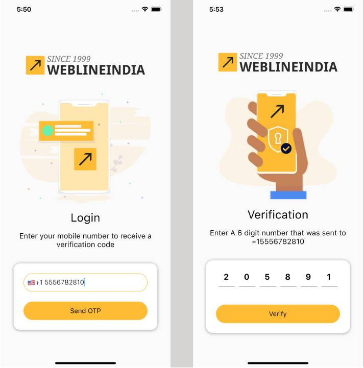

# Flutter - OTP Authentication

A Flutter based OTP Authentication component, used to verify your mobile number with OTP (One Time Password) using Firebase Authentication. 

## Table of contents
- [Flutter Support](#flutter-support)
- [Demo](#demo)
- [Features](#features)
- [Getting started](#getting-started)
- [Usage](#usage)
- [Methods](#methods)
- [Want to Contribute?](#want-to-contribute)
- [Need Help / Support?](#need-help)
- [Collection of Components](#collection-of-Components)
- [Changelog](#changelog)
- [License](#license)
- [Keywords](#Keywords)

## Flutter Support

Version - Flutter 3.35.7 (stable)

We have tested our program in above version, however you can use it in other versions as well.

## Demo

------

## Features

* Select country with flag & country code. 
* Verify mobile number with OTP all over the world.

## Getting started

* Download this sample project and import widget dart files in your Flutter App. 
* Update Widgets UI based on your requirements. 

## Usage

Setup process is described below to integrate in sample project.

### Methods

Configure Firebase in main method.
    
    WidgetsFlutterBinding.ensureInitialized();
    Platform.isAndroid
        ? await Firebase.initializeApp(
            options: const FirebaseOptions(
                apiKey: 'xxxxxxxxxxxx-g-famDgC3jx6VV4h-xxxxxx',
                appId: '1:xxxxxxxxxxxx:android:xxxxxxxb7ea052854b0005',
                messagingSenderId: 'xxxxxxxxxxxx',
                projectId: 'flutterxxxxxxxxx-9xxxa'))
        : await Firebase.initializeApp();

Configure Country Picker Widget & implement method for call back selected country details e.g
      
    // Put CountryPicker Widget
    CountryPicker(
        callBackFunction: _callBackFunction
    );
       
    // Create callback function 
    void _callBackFunction(String name, String dialCode, String flag) {
        // place your code
    }
    
Configure OtpPinField For OTP (One Time Password)
    
    // add these packages in pubspec.yaml file
      firebase_core: ^4.3.0
      otp_pin_field: ^1.4.1
       
    // run this command to install package
    flutter pub get
       
    // initialize key and add OtpPinField in class

    final _otpPinFieldKey = GlobalKey<OtpPinFieldState>();

    OtpPinField(
      key: _otpPinFieldKey,
      textInputAction: TextInputAction.done,
      maxLength: 6,
      fieldWidth: 40,
      onSubmit: (text) {
            smsOTP = text;
      },
      onChange: (text) {}
    )
      
Validate Phone Number & Generate Otp     
      
    // generate otp method and store Verification Id
    Future<void> generateOtp(String contact) async {
      final PhoneCodeSent smsOTPSent = (verId, forceResendingToken) {
      verificationId = verId;
      };
      try {
        await _auth.verifyPhoneNumber(
        phoneNumber: contact,
        codeAutoRetrievalTimeout: (String verId) {
          verificationId = verId;
        },
        codeSent: smsOTPSent,
        timeout: const Duration(seconds: 60),
        verificationCompleted: (AuthCredential phoneAuthCredential) {},
        verificationFailed: (error) {
          print(error);
        },
       );
      } catch (e) {
      handleError(e as PlatformException);
     }
    }
       

Verify otp                   
       
    //Method for verify otp entered by user  
    Future<void> verifyOtp() async {
       if (smsOTP.isEmpty || smsOTP == '') {
          showAlertDialog(context, 'please enter 6 digit otp');
          return;
        }
        try {
              final AuthCredential credential = PhoneAuthProvider.credential(
                verificationId: verificationId,
                smsCode: smsOTP,
              );
              final UserCredential user = await _auth.signInWithCredential(credential);
              final User? currentUser = _auth.currentUser;
              assert(user.user?.uid == currentUser?.uid);
              Navigator.pushReplacementNamed(context, '/homeScreen');
            } on PlatformException catch(e){
          handleError(e);
        } catch (e) {
              print('error $e');
            }
      }

Handle errors

    //Method for handle the errors
    void handleError(PlatformException error) {
      switch (error.code) {
        case 'ERROR_INVALID_VERIFICATION_CODE':
          FocusScope.of(context).requestFocus(FocusNode());
          setState(() {
            errorMessage = 'Invalid Code';
          });
          showAlertDialog(context, 'Invalid Code');
          break;
        default:
          showAlertDialog(context, error.message ?? 'Error');
          break;
      }
    }
    
------

## Directive options

### Firebase project setup steps

Create Project setup in firebase console using below URL [https://console.firebase.google.com/](https://console.firebase.google.com/) . Enable Phone Number sign-in for your Firebase project in console
[https://firebase.google.com/docs/auth/ios/phone-auth](https://firebase.google.com/docs/auth/ios/phone-auth])

Download GoogleService-Info.Plist file and add into iOS folder

Download GoogleService.json file and add into Android folder

### Firebase project setup steps

Install following pub dev package

firebase_auth: ^6.1.3

------

## Want to Contribute?

- Created something awesome, made this code better, added some functionality, or whatever (this is the hardest part).
- [Fork it](http://help.github.com/forking/).
- Create new branch to contribute your changes.
- Commit all your changes to your branch.
- Submit a [pull request](http://help.github.com/pull-requests/).

 ------
 
## Collection of Components
 We have built many other components and free resources for software development in various programming languages. Kindly click here to view our [Free Resources for Software Development.](https://www.weblineindia.com/software-development-resources.html)
 
------

## Changelog
Detailed changes for each release are documented in [CHANGELOG](./CHANGELOG).

## License
[MIT](LICENSE)

[mit]: https://github.com/weblineindia/Flutter-OTP-Authentication/blob/master/LICENSE

## Keywords
Flutter-OTP-Authentication, Firebase-OTP-Authentication, Firebase-Authentication, Firebase, Authentication, OTP-Authetication
